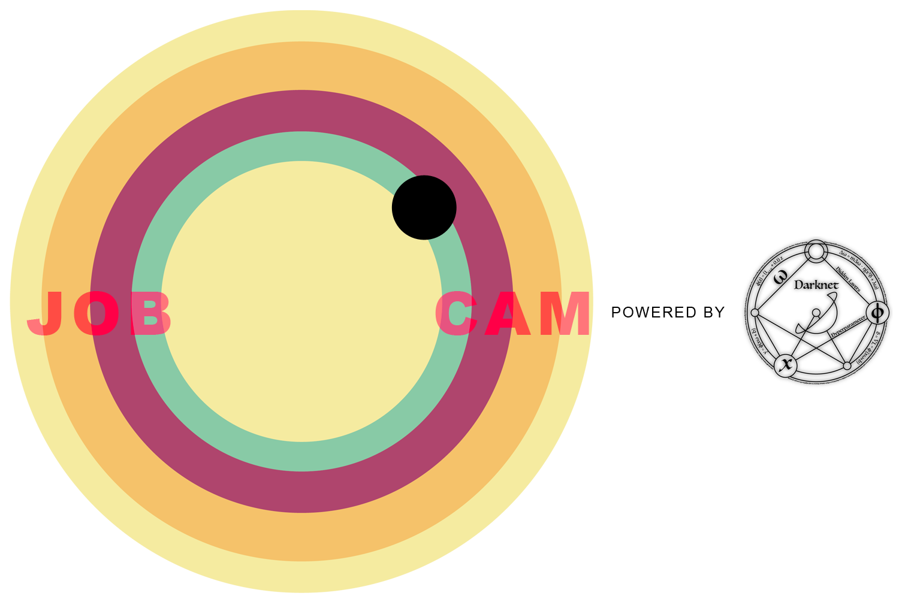

JobCam is a fun new way to find jobs in your area. It allows you to target your phone at an object, and then through the infocom API we can find a closely matching job, that will be overlayed. The app will process data in real time allowing the user to move the phone around the room to find interesting jobs that they had not considered. 

### Current Project Roles

- Android App Development (UI)
- Android App Development (AR)
- Object Detection
- Backend Server side

### Team
- [@bnelo12](https://github.com/bnelo12)
- [@rphi](https://github.com/rphi)
- [@kubasz](https://github.com/kubasz)
- [@qaisjp](https://github.com/qaisjp)

### Getting it running

First up, this app has two parts, the Object Detection Server, written in C++, which contains an instance of the 
[YOLOv3](https://pjreddie.com/darknet/yolo/) neural network, and exposes an HTTP endpoint offering classification 
of JPG files, and the Android application itself.

**Android App**
Should be fairly straightforward, it was built with Android Studio to target API version 28. You'll need to add your key 
to `app/res/values/strings.xml` (yes this probably ought to be elsewhere) Also in `CameraActivity` you need to set the URL on line `170` to point to your instance of the Object Detection Server

**Object Detection Server**
  1. Build [DarkNet](https://pjreddie.com/darknet/) (a submodule in the repo)
  2. Download the YOLOv3 weights
  3. Modify config to match your system capability
  4. Install Boost and Cmake
  5. Run Cmake on the directory
  6. Use the new makefile to compile the server
  7. Run from command-line
